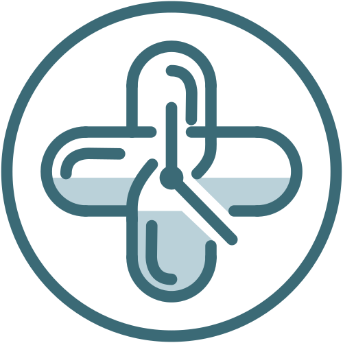

# Tempomedic-Interfaz

Interfaz de la Aplicación de salud en Java (Swing/MVC) para gestionar medicación y citas médicas: recordatorios por notificación o alarma, e historial de tomas. Proyecto Intermodular DAM.

Repositorio principal: <https://github.com/SantiagoGonzalez12/Tempomedic>

## Índice

1. [El problema](#1-el-problema)
2. [Identificación del público objetivo](#2-identificación-del-público-objetivo)
3. [Las decisiones técnicas](#3-las-decisiones-técnicas)
4. [Objetivos Principales de la Interfaz (UI/UX)](#4-objetivos-principales-de-la-interfaz-uiux)
5. [El proceso de trabajo](#5-el-proceso-de-trabajo)
6. [Las pruebas](#6-las-pruebas)
7. [El resultado obtenido](#7-el-resultado-obtenido)

---

## 1. El problema

Siempre se ha tenido el problema de "¿A que hora me toca la medicación?" y se nos olvida tomarla. Esto puede desencadenar severos problemas y afectar gravemente a la salud. No todo queda ahí, además, el proceso de poder coger cita médica es apps públicas o mismamente presencial provoca "desesperación" a las personas. Por lo cuál se ha decidido desarrollar una app que cubra estas necesidades y que ayude positivamente a la toma de los medicamentos. 

## 2. Identificación del Público Objetivo

La aplicación está diseñada para responder a las necesidades de gestión de salud de diferentes perfiles de usuarios. Tras el análisis de la encuesta y las necesidades del sector, se han identificado tres grupos principales de público objetivo:

### 2.1. Pacientes con Tratamientos Temporales u Ocasionales

* **Perfil:** Personas jóvenes o adultas que toman medicamentos durante un periodo concreto (antibióticos, analgésicos o tratamientos de 7 a 15 días).
* **Necesidad principal:** Necesitan un sistema de alertas preciso que no dependa de acordarse manualmente del horario entre tomas, cada ocho horas por ejemplo.
* **Solución que les ofrece la app:** Programación rápida de avisos con fecha de inicio y fin evitando olvidos por distracciones en su rutina

### 2.2. Pacientes Crónicos o con numero elevado de pastillas

* **Perfil:** Personas adultas o de avanzada edad que deben tomar varios medicamentos al día de forma continuada y acudir a revisiones médicas periódicas.
* **Necesidad principal:** Evitar confusiones con las dosis, los horarios y no perder las citas de seguimiento con sus médicos.  

## 3. Las decisiones técnicas

### 3.1. Análisis comparativo(benchmarking)

#### Aplicaciones similares en el mercado

* **MedControl**: funciona como un asistente de salud personal y pastillero virtual. Permite crear alarmas personalizadas para medicamentos, llevar un control de inventario y organizar recordatorios para citas médicas. Además, incluye un diario de tensión arterial y seguimiento de síntomas.  
* **Recordatorio de Medicamentos 2**: se centra en la adherencia al tratamiento. Ofrece recordatorios altamente configurables (cada X horas, días específicos, etc.), alertas cuando quedan pocas pastillas y la posibilidad de enviar reportes por correo al médico. Además permite agendar recordatorios de citas médicas.  
* **CareClinic**: va más allá de la medicación. Permite a los usuarios registrar síntomas, mediciones, estado de ánimo y nutrición. Sus recordatorios son personalizables para medicamentos y citas, también admite la gestión de múltiples perfiles, como hijos o personas mayores.  
* **Biva**: está diseñada para pacientes y cuidadores. Permite registrar condiciones médicas y tratamientos, estableciendo recordatorios para cada uno. Integra servicios como la recarga de medicamentos y la reserva de citas médicas, con un enfoque en la relación paciente-cuidador.  
* **DayMedy**: es una aplicación de telemedicina que integra consultas en línea, gestión de prescripciones digitales y programación de citas. Tras una consulta, el usuario recibe la receta en la app y puede configurar recordatorios para la medicación. También permite gestionar los registros de salud de la familia.  
* **Medical Reminder**: se enfoca en la simplicidad y la privacidad, funcionando sin conexión a internet. Ofrece recordatorios fiables para medicamentos y citas médicas, con un diseño de texto grande ideal para adultos mayores y cuidadores. Permite generar informes de salud en PDF para compartir con los médicos.  
* **Otras aplicaciones**: también existen ejemplos como **IMQ** (de una aseguradora de salud), **MyCarePlan**, **PineApp** y **MedGemak**, que ofrecen funcionalidades parciales o totales, como gestión de citas, historial clínico, videoconsulta y alarmas de medicación.

#### Noticias y tendencias recientes

* **Éxito de las tarjetas sanitarias virtuales**: en la Comunidad de Madrid, la Tarjeta Sanitaria Virtual (TSV) ha registrado cerca de 57 millones de accesos en 2025, un 43,5% más que el año anterior. Los servicios más utilizados son la gestión de citas médicas, la consulta de medicación y el acceso a informes. La aplicación ha incorporado herramientas como recordatorios de citas de atención primaria, que han enviado más de 5 millones de notificaciones, y alertas sobre la dispensación de medicamentos en farmacias.  
* **Integración de IA en portales de pacientes**: Oracle Health ha lanzado un portal de pacientes con inteligencia artificial que ofrece resúmenes de salud, recordatorios automáticos de visitas y la posibilidad de programar citas de seguimiento. Esta IA ayuda a los pacientes a entender sus planes de cuidado y medicamentos en un lenguaje sencillo, buscando mejorar la adherencia al tratamiento.  
* **Nuevos modelos de negocio y funcionalidades**: Startups como **Assort Health** han levantado capital significativo para plataformas que utilizan IA para conectar la programación de citas, la gestión de medicamentos y los pagos en un solo sistema. Por otro lado, **Amazon** ha lanzado un agente de IA para la salud que puede reservar citas y gestionar recetas médicas.  
* **Investigación en universidades**: investigadores de la Universidad Miguel Hernández (UMH) de Elche han desarrollado una aplicación para que personas con inmunodeficiencias puedan autogestionar su enfermedad, incluyendo el control de citas y tratamientos con recordatorios personalizados.

#### Estudios académicos sobre eficacia

La literatura científica respalda la eficacia de las aplicaciones móviles para mejorar la adherencia a los tratamientos, especialmente en enfermedades crónicas.

* **Mejora de la adherencia en diabetes**: un metaanálisis de 2025 concluyó que las intervenciones mediante aplicaciones móviles tienen un efecto positivo en la adherencia a la medicación y en el control de la diabetes mellitus tipo 2\.  
* **Eficacia general de las intervenciones mHealth**: una revisión sistemática y metaanálisis de 2025, publicada en el Journal of Medical Systems, encontró que las intervenciones de salud móvil son efectivas para mejorar la adherencia a la medicación en pacientes con enfermedades crónicas.  
* **Adherencia en enfermedad renal crónica**: revisión sistemática de 2025 se centró en pacientes con enfermedad renal crónica y concluyó que las aplicaciones móviles mejoran la adherencia, aunque la evidencia es limitada y se necesitan estudios de mayor duración.  
* **Impacto en pacientes oncológicos**: investigaciones recientes indican que las intervenciones digitales, como las aplicaciones móviles y los sistemas de recordatorio, pueden ayudar a los pacientes con cáncer a adherirse mejor a su medicación.
### 3.2. Desarrollo y mejora del producto(Product Backlog)
**Módulo de Medicación y Recordatorios** 

En este primer bloque funcional, el desarrollo arranca con la posibilidad de que el usuario registre un tratamiento especificando el nombre del fármaco, la dosis adecuada y las horas exactas de toma. La prioridad técnica reside en garantizar que la aplicación programe notificaciones locales en el sistema operativo del teléfono, asegurando que los avisos se emitan puntualmente de manera autónoma, incluso si el dispositivo carece de conexión a internet o la aplicación se encuentra cerrada.
Una vez emitida la alerta, la experiencia se complementa permitiendo que el usuario interactúe directamente con la notificación o la pantalla principal para marcar la dosis como «Tomada» u «Omitida». Esta acción simple actualiza instantáneamente un registro diario de cumplimiento. Con este flujo cerrado de creación, notificación y confirmación de tomas, el usuario obtiene una solución funcional y directa para la adherencia a su medicación, cubriendo la necesidad principal con el mínimo esfuerzo de desarrollo técnico y sin requerir infraestructura en la nube. 

**Módulo de Agenda de Citas Médicas**

El segundo componente esencial aborda la organización de las consultas de salud a través de una agenda sencilla pero efectiva. La funcionalidad permite al usuario completar un formulario básico donde indica la especialidad o el nombre del profesional, la fecha, la hora y el lugar de la consulta, guardando la información en la memoria local del dispositivo. Al momento del registro, el sistema programa automáticamente dos recordatorios preventivos, uno emitido veinticuatro horas antes y otro dos horas antes de la cita, para evitar olvidos o desplazamientos apresurados.
Para maximizar la utilidad del módulo sin elevar la complejidad de la aplicación, el sistema ofrece la opción de exportar la cita creada al calendario nativo del teléfono (como Google Calendar o Apple Calendar). Mediante este enlace con las herramientas que el usuario ya utiliza en su día a día, la aplicación logra integrar la gestión médica en su rutina diaria de manera transparente, completando así la propuesta de valor inicial del proyecto.

**Criterios de Aceptación y Preparación para Siguientes Fases**

Todas las historias de usuario comparten una restricción clave: la persistencia de datos debe ser estrictamente local y cifrada dentro del dispositivo del usuario. Un requisito de aceptación imprescindible para dar por finalizada esta primera versión es la verificación de las alarmas en diferentes escenarios de ahorro de batería de Android e iOS, garantizando que el sistema no cancele las notificaciones en segundo plano.
Las funcionalidades orientadas a la gestión de inventario de pastillas, el control de perfiles familiares, la carga de documentos adjuntos o las integraciones con bases de datos farmacológicas quedan explícitamente pospuestas para las iteraciones posteriores al lanzamiento. De este modo, la primera entrega concentrará todo el esfuerzo técnico en la fiabilidad de los recordatorios y la simplicidad de la agenda.

### 3.3. Registro del sprint(Sprint Backlog)
El desarrollo del Sprint 1 se ha enfocado en consolidar las bases, el diseño visual de las interfaces y la arquitectura del proyecto **TempoMedic**. 
* **Fechas de ejecución:** 12/10 – 23/10
* **Objetivo principal:** Diseñar la maquetación visual de las pantallas, procesar los datos de investigación mediante encuestas, recolección de los datos, documentación de información
| **S1-01** | Procesamiento y análisis de las encuestas de recolección de usuarios / Completado |
| **S1-02** | Redacción de Historias de Usuario (HU01-HU05) y Criterios de Aceptación / Completado |
| **S1-03** | Diseño de la arquitectura gráfica/ Completado |
| **S1-04** | Diseñar el modelo de datos local (`Cita`, `Medicamento`, `Toma`) / Completado |
| **S1-05** | Maquetación visual e interfaz accesible / Completado |
| **S1-06** | Redacción del plan de seguridad, privacidad / Completado |
| **S1-07** | Lógica y diseño del sistema de recordatorios (alarmas/notificaciones sonoras y silenciosas) / Completado |
| **S1-08** | Plan de seguimiento, plantilla de pruebas y gestión de incidencias en GitHub / Completado |
| **S1-09** | Sesión de Cierre / Completado |
* 
## 4.  Objetivos Principales de la Interfaz (UI/UX)

Puedes encontrar los bocetos de la interfaz en `docs\img\BocetosVistas` o en la [previsualización de Figma](https://www.figma.com/proto/ubk5OfKsRbFFkuf4rPfQUt/Tempomedic-%E2%80%93-Bocetos-Sprint-1--D2-?node-id=2-23&p=f&t=8uHJ1BrWqsgY0J3Z-1&scaling=scale-down&content-scaling=fixed&page-id=0%3A1&starting-point-node-id=2%3A2).

El diseño de la interfaz de **Tempomedic** se ha estructurado para ofrecer una experiencia sencilla, accesible y adaptada a las necesidades obtenidas en la encuesta. Los objetivos  del diseño son:

### Centralización en un Dashboard Diario ("Hoy")

* **Vista unificada:** La pantalla principal consolida en un único vistazo las tomas de medicación pendientes/completadas y las próximas citas médicas programadas
* **Gestión de estados rápida:** Permite cambiar el estado de las tomas con botones directos de *"Tomada"*, *"Posponer"* u *"Omitida"* sin tener que navegar por varios menús

### Navegación Sencilla e Intuitiva

* **Navegación inferior fija :** La aplicación utiliza una barra principal con 4 secciones  definidas (*Hoy*, *Medicamentos*, *Citas*, *Ajustes*) para permitir un acceso rápido a cualquier función en 1 solo clic
* **Formularios estructurados:** Las pantallas para añadir o editar medicamentos y citas emplean un diseño limpio mediante campos de selección y menús desplegables para agilizar la introducción de datos

### Personalización y Accesibilidad Universal

* **Ajuste de visibilidad y temas:** Desde la sección de ajustes, el usuario puede adaptar el tamaño del texto (*Normal*, *Grande*, *Muy grande*) y alternar entre tema *Claro* u *Oscuro* para facilitar la lectura a personas con visión reducida
* **Notificaciones a medida:** Permite configurar de forma global o individual el tipo de aviso (*Notificación*, *Alarma* o *Ambos*), respondiendo a la diversidad de preferencias detectada en los usuarios

### Seguridad, Privacidad y Feedback Claro

* **Protección mediante PIN de acceso:** Implementación de una pantalla de desbloqueo rápido por PIN como capa extra de seguridad para los datos médicos del usuario
* **Feedback:** La interfaz confirma las acciones del usuario de forma transparente

## 5. El proceso de trabajo
Para comenzar, se ha analizado el perfil de los usuarios a través de una encuesta recopilando sus necesidades, las ventajas, desventajas y sus preferencias. Posteriormente, tras los resultados, se ha puesto en común las ideas surgidas y la toma de decisiones para poder comenzar a trabajar y meter mano en la aplicación. 
Con diversos problemas surgidos para la elección del nombre, al final se ha decidido por TempoMedic. Una vez que la app va cogiendo personalidad propia, se comienza a buscar los colores identificativos para la interfaz, mostrada anteriormente, con colores tenues y sencillo que sea agradable a la vista de los usuarios. 
## 6. Las pruebas

## 7. El resultado obtenido
